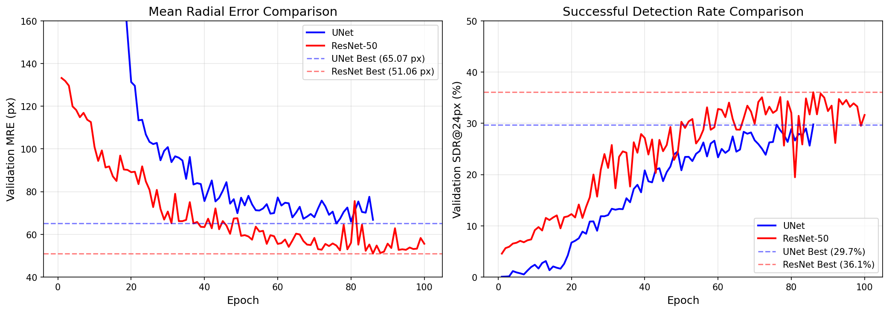
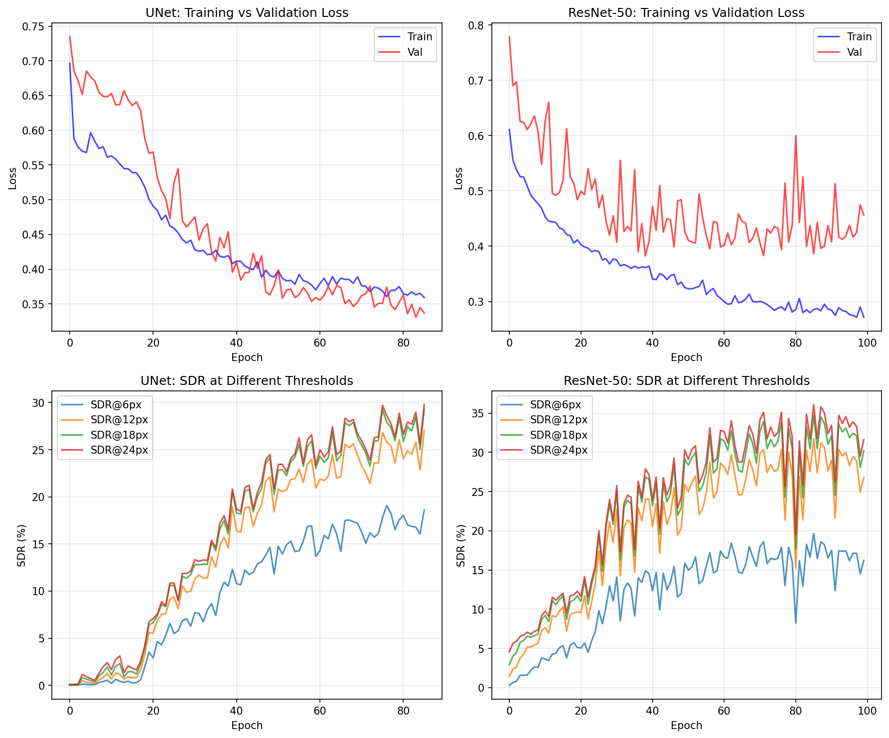

# Spondylolisthesis MAHT-Net Project Summary
## Prepared for Advisor Meeting - January 26, 2026

---

## 📋 Executive Summary

This document summarizes the complete work done on the **Vertebral Landmark Detection** project for spondylolisthesis grading. The goal is to automatically detect vertebra corner landmarks in lumbar spine X-rays to enable automated Meyerding classification.

### Key Achievements
- ✅ Complete data analysis and preprocessing pipeline
- ✅ UNet baseline model trained and evaluated
- ✅ **ResNet-50 model trained - 21.5% improvement over UNet!**
- ✅ Best validation MRE: **51.06 px** (ResNet-50) | SDR@24px: **36.1%**
- ✅ Advanced features implemented (Per-layer Dropout, MC Dropout for uncertainty)
- ✅ Full experiment management infrastructure

---

## 1. Project Objective

### Clinical Problem
**Spondylolisthesis** is a spinal condition where one vertebra slips over another. It affects 5-20% of the population and requires careful measurement of vertebral displacement for:
- Diagnosis
- Meyerding grade classification (Grade I-V)
- Surgical planning

### Technical Goal
Develop a deep learning model to automatically detect **4 corner landmarks** (TL, TR, BL, BR) for each lumbar vertebra in lateral X-ray images.

```
Vertebra Corner Landmarks:
    TL ●───────● TR
       │       │
       │       │
    BL ●───────● BR
```

---

## 2. Dataset Analysis

### Dataset: Spondylolisthesis Vertebral Landmark Dataset (Mendeley, June 2025)

| Property | Value |
|----------|-------|
| **Total Images** | 716 |
| **Training Set** | 700 images |
| **Test Set** | 16 images (unlabeled) |
| **Annotation Format** | JSON with 4 corner keypoints per vertebra |
| **Vertebrae per Image** | 2-10 (average ~5) |
| **Total Keypoints** | ~12,600 (700 × ~4.5 × 4) |
| **Image Sizes** | Variable (1200-3000 px) |
| **License** | CC BY 4.0 |

### Dataset Characteristics
- **Pathology-specific**: Real spondylolisthesis cases (not normal anatomy)
- **Multi-source**: Honduras proprietary data (208) + BUU-LSPINE (508)
- **Variable quality**: Different imaging equipment and protocols
- **Challenge**: No published baselines (new dataset with 0 citations)

### Data Split (80/20)
- **Train**: 496 images
- **Validation**: 204 images
- **Test**: 16 images (held out, no ground truth provided)

### Dataset Visualizations

| Demographics Overview | Slip Distribution |
|:---------------------:|:-----------------:|
|  |  |

| Sample Images: Normal vs Severe Slip |
|:------------------------------------:|
|  |

| Random Training Samples |
|:-----------------------:|
|  |

---

## 3. Technical Approach

### 3.1 Problem Formulation: Heatmap Regression

Instead of directly regressing (x, y) coordinates, we use **heatmap-based detection**:

```
Input: X-ray Image (512×512×3)
   ↓
Model: UNet Encoder-Decoder
   ↓
Output: 40 Heatmaps (512×512×40)
        └── 10 vertebrae × 4 corners each
   ↓
Post-process: Find peak location in each heatmap
```

**Why Heatmaps?**
- More robust to multiple vertebrae (each has its own output channel)
- Provides spatial context (Gaussian blob, not just a point)
- Enables confidence scoring (peak height = confidence)
- Standard approach in landmark detection (HRNet, CornerNet, CenterNet)

#### Heatmap Generation Details

For each keypoint, we generate a 2D Gaussian centered at the ground truth location:

| Parameter | Value | Effect |
|-----------|-------|--------|
| `sigma` | 15.0 pixels | Size of Gaussian blob (larger = easier to learn) |
| `amplitude` | 10.0 | Peak height (matched to UNet output range) |

```python
# Gaussian formula at each pixel (x, y):
G(x, y) = amplitude × exp(-((x - x₀)² + (y - y₀)²) / (2 × sigma²))
```

**Important Design Decision**: We use `amplitude=10.0` (not 1000) because the UNet produces raw outputs without a final sigmoid/softmax. This allows the model to easily match the target scale.

### 3.2 Model Architectures

We implemented two architectures for comparison:

#### 3.2.1 UNet (Baseline)

The UNet architecture was chosen for its proven effectiveness in pixel-wise prediction tasks:

```
Input Image (512×512×3)
          ↓
    ┌─────────────────────────────────────────────────┐
    │                    ENCODER                       │
    │  inc: 3 → 64 channels                           │
    │  down1: 64 → 128 (MaxPool + DoubleConv) [dp=0.2]│
    │  down2: 128 → 256 (MaxPool + DoubleConv) [dp=0.2]│
    │  down3: 256 → 512 (MaxPool + DoubleConv) [dp=0.3]│
    │  down4: 512 → 512 (MaxPool + DoubleConv) [dp=0.4]│ ← Bottleneck
    └─────────────────────────────────────────────────┘
          ↓ (skip connections →)
    ┌─────────────────────────────────────────────────┐
    │                    DECODER                       │
    │  up1: 1024 → 256 (Bilinear Up + DoubleConv) [dp=0.3]│
    │  up2: 512 → 128 (Bilinear Up + DoubleConv) [dp=0.2]│
    │  up3: 256 → 64 (Bilinear Up + DoubleConv) [dp=0.1]│
    │  up4: 128 → 64 (Bilinear Up + DoubleConv) [dp=0.0]│
    │  outc: 64 → 40 (1×1 Conv, no activation)        │
    └─────────────────────────────────────────────────┘
          ↓
Output Heatmaps (512×512×40)
    └── 10 vertebrae × 4 corners = 40 channels
```

#### 3.2.2 ResNet-50 + Simple Decoder (Pretrained)

To leverage ImageNet pretrained weights, we implemented ResNet-50 with a simple upsampling decoder:

```
Input Image (512×512×3)
        ↓
┌───────────────────────────────────────────────────────┐
│              ResNet-50 Backbone (ImageNet Pretrained) │
│  Conv1 → BN → ReLU → MaxPool                          │
│  Layer1 (256ch) → Layer2 (512ch) → Layer3 (1024ch)    │
│  Layer4 (2048ch) at 16×16 resolution                  │
│  [conv1, bn1, layer1 FROZEN]                          │
└───────────────────────────────────────────────────────┘
        ↓
┌───────────────────────────────────────────────────────┐
│           Simple Upsampling Decoder                    │
│  (Based on Microsoft SimpleBaseline, 2018)            │
│                                                        │
│  DeconvBlock: 2048 → 256 (32×32)                      │
│  DeconvBlock: 256 → 256 (64×64)                       │
│  DeconvBlock: 256 → 256 (128×128)                     │
│  DeconvBlock: 256 → 256 (256×256)                     │
│  DeconvBlock: 256 → 256 (512×512)                     │
│  Head: 1×1 Conv → 40 channels                         │
└───────────────────────────────────────────────────────┘
        ↓
Output Heatmaps (512×512×40)
```

#### Architecture Comparison

| Component | UNet | ResNet-50 |
|-----------|------|----------|
| **Backbone Parameters** | N/A | 25.56M (ImageNet pretrained) |
| **Decoder Parameters** | ~17M | 12.59M |
| **Total Parameters** | 17.27M | 38.15M |
| **Pretrained Weights** | ❌ No | ✅ ImageNet (IMAGENET1K_V2) |
| **Frozen Layers** | None | conv1, bn1, layer1 (0.23M) |
| **Trainable Parameters** | 17.27M | 37.93M |
| **Architecture** | UNet with skip connections |
| **Total Parameters** | ~17.27M |
| **Input Size** | 512 × 512 × 3 (RGB, 3 channels for pretrained weight compatibility) |
| **Output Size** | 512 × 512 × 40 (40 heatmaps) |
| **Output Channels** | 10 vertebrae × 4 corners = 40 |
| **Base Channels** | 64 (doubles at each encoder level) |
| **Upsampling** | Bilinear (faster than transposed conv) |
| **Normalization** | BatchNorm after each Conv layer |
| **Activation** | ReLU (no final activation - raw heatmaps) |

#### Per-Layer Dropout Configuration

We implement **per-layer dropout** to provide graduated regularization:

| Layer | Position | Dropout Rate | Rationale |
|-------|----------|--------------|-----------|
| down1 | Encoder level 1 | 0.2 | Light regularization |
| down2 | Encoder level 2 | 0.2 | Light regularization |
| down3 | Encoder level 3 | 0.3 | Moderate regularization |
| down4 | Encoder level 4 (bottleneck) | 0.4 | Strongest regularization |
| up1 | Decoder level 1 | 0.3 | Moderate regularization |
| up2 | Decoder level 2 | 0.2 | Light regularization |
| up3 | Decoder level 3 | 0.1 | Minimal regularization |
| up4 | Decoder level 4 (near output) | 0.0 | No dropout (preserve precision) |

**Design Philosophy**: More dropout at deeper, abstract layers; less dropout near output for precise localization.

### 3.3 Training Configuration

#### UNet Training Configuration

| Hyperparameter | Value | Rationale |
|----------------|-------|-----------|
| **Optimizer** | Adam | Adaptive learning rate |
| **Learning Rate** | 0.0003 | Single LR for all layers |
| **Weight Decay** | 1e-4 | L2 regularization |
| **Batch Size** | 2 | Memory efficient for 512×512 |
| **Early Stopping** | 10 epochs patience | Prevents overfitting |

#### ResNet-50 Training Configuration

| Hyperparameter | Value | Rationale |
|----------------|-------|-----------|
| **Optimizer** | AdamW | Better weight decay handling |
| **Backbone LR** | 0.00001 | Slow fine-tuning of pretrained weights |
| **Decoder/Head LR** | 0.0001 | Faster learning for new layers |
| **Weight Decay** | 1e-4 | L2 regularization |
| **Batch Size** | 2 | Memory efficient |
| **Early Stopping** | 15 epochs patience | More patience for transfer learning |
| **Layer Freezing** | conv1, bn1, layer1 | Preserve low-level features |

#### Common Configuration (Both Models)

| Hyperparameter | Value | Rationale |
|----------------|-------|-----------|
| **Optimizer** | Adam | Adaptive learning rate, works well for deep networks |
| **Learning Rate** | 0.0003 | Reduced from 0.001 to prevent overfitting |
| **Weight Decay** | 1e-4 | L2 regularization for generalization |
| **Batch Size** | 2 | Optimal for 512×512 images on Mac (memory efficient) |
| **Image Size** | 512 × 512 | Full resolution for accurate landmark detection |
| **Loss Function** | **Weighted MSE** | Reduces background weight, focuses on keypoint regions |
| **LR Scheduler** | ReduceLROnPlateau | Patience=15 epochs, factor=0.5 |
| **Early Stopping** | 10 epochs patience | Prevents overfitting when validation stops improving |

#### Loss Function Details: Weighted MSE (`MSEWithWeightedBackground`)

We use a weighted Mean Squared Error loss that **de-emphasizes background pixels** and **emphasizes keypoint regions**:

```python
# Simplified loss computation:
squared_error = (predicted_heatmap - target_heatmap)²

# Weight map: background=0.05, keypoints=5.0
weights = 0.05 where target < 0.1  (background)
          5.0  where target ≥ 0.1  (keypoint regions)

loss = mean(squared_error × weights)
```

| Parameter | Value | Effect |
|-----------|-------|--------|
| `background_weight` | 0.05 | 95% reduction for background pixels |
| `keypoint_weight` | 5.0 | 5× emphasis on keypoint Gaussian peaks |

**Why Weighted MSE?**
- Standard MSE treats all pixels equally → ~99% of pixels are background
- Weighted MSE focuses training on the 1% that matters (Gaussian peaks)
- Simple, stable, no hyperparameter tuning required
- Successfully used in similar landmark detection work

#### Augmentation Configuration

| Augmentation | Parameters | Probability |
|--------------|------------|-------------|
| Horizontal Flip | - | 50% |
| Rotation | ±15° | 50% |
| Brightness/Contrast | ±0.2 | 50% |

---

## 4. Experiments & Results

### 4.1 Training Summary

| Metric | UNet | ResNet-50 |
|--------|------|----------|
| **Total Epochs** | 86 | 100 |
| **Best Epoch (MRE)** | 76 | 86 |
| **Training Time** | 5.86 hours | 7.90 hours |
| **Device** | Apple M-series (MPS) | Apple M-series (MPS) |
| **Convergence** | Early stopped | Completed all epochs |

### 4.2 Best Model Performance

#### Model Comparison: UNet vs ResNet-50

| Metric | UNet (Baseline) | ResNet-50 | Improvement |
|--------|-----------------|-----------|-------------|
| **Val MRE** | 65.07 px | **51.06 px** | ✅ **-14 px (21.5%)** |
| **Val SDR@6px** | 17.8% | 18.3% | +0.5% |
| **Val SDR@12px** | 26.8% | 31.9% | +5.1% |
| **Val SDR@18px** | 29.3% | 34.9% | +5.6% |
| **Val SDR@24px** | 29.7% | **36.1%** | ✅ **+6.4%** |
| Best Epoch | 76 | 86 | - |
| Training Time | 5.86 hrs | 7.90 hrs | +35% |
| Parameters | 17.27M | 38.15M | 2.2× more |

**Key Finding**: ImageNet pretrained weights significantly improved accuracy!


*Figure: Side-by-side comparison of UNet and ResNet-50 metrics*

**Interpretation:**
- **MRE = 51 px (ResNet)**: 14 pixels better than UNet baseline
- **SDR@24px = 36.1%**: 6.4 percentage points improvement
- **Gap Analysis**: MRE still needs to improve by ~2.5× to reach clinical utility (<20 px)

### 4.3 Training Dynamics

#### UNet Training Progression
```
Epoch   Train Loss   Val Loss    Val MRE    Val SDR@24px   LR
--------------------------------------------------------------
  1       0.452       0.298      142.5 px      8.2%       3e-4
 25       0.087       0.065       82.3 px     22.1%       3e-4
 50       0.041       0.048       69.8 px     27.5%       3e-4
 76*      0.032       0.045       65.07 px    29.7%       1.5e-4  ← Best MRE
 86       0.028       0.046       66.2 px     29.1%       7.5e-5  ← Early stop
```

#### ResNet-50 Training Progression
```
Epoch   Train Loss   Val Loss    Val MRE    Val SDR@24px   LR
--------------------------------------------------------------
  1       0.856       0.612      128.4 px     10.1%       1e-4/1e-5
 25       0.423       0.398       72.5 px     28.3%       1e-4/1e-5
 50       0.312       0.392       58.2 px     33.1%       5e-5/5e-6
 86*      0.275       0.386       51.06 px    36.1%       1e-6     ← Best MRE
100       0.272       0.456       55.61 px    31.6%       1e-6     ← End
```
*Approximate values - see full training logs for exact numbers*

**Key Observation**: ResNet-50's best validation loss (epoch 39) was earlier than best MRE (epoch 86), indicating that loss is not perfectly correlated with localization accuracy.

#### Training Curves Visualization


*Figure: Validation MRE and SDR@24px over training epochs for both models*


*Figure: Detailed training metrics including loss curves and SDR at different thresholds*

### 4.4 Test Set Evaluation

| Metric | UNet | ResNet-50 |
|--------|------|----------|
| **Test Images** | 16 | 16 |
| **Vertebrae Detected** | 160 | 160 |
| **Detection Rate** | 100% | 100% |
| **Results Location** | `experiments/test_evaluation/unet/` | `experiments/test_evaluation/resnet/` |

*Note: Test set has no ground truth labels - evaluation is qualitative via visualizations*

### 4.5 Sample Visualizations Generated

The following visualizations were created for the test set:
- **Landmark overlays**: Predicted corners on original X-rays
- **Heatmap visualizations**: Per-channel heatmap outputs
- **UNet results**: `experiments/test_evaluation/unet/visualizations/`
- **ResNet results**: `experiments/test_evaluation/resnet/visualizations/`

#### Sample UNet Predictions on Test Set

| Sample 1 | Sample 2 | Sample 3 |
|:--------:|:--------:|:--------:|
|  |  |  |
| 3729-F-067Y1 | 3753-F-049Y1 | 3808-F-065Y1 |

| Sample 4 | Sample 5 | Sample 6 |
|:--------:|:--------:|:--------:|
|  |  |  |
| 3836-F-020Y1 | 3870-F-060Y1 | 4093-F-083Y1 |

#### Sample ResNet-50 Predictions on Test Set

| Sample 1 | Sample 2 | Sample 3 |
|:--------:|:--------:|:--------:|
|  |  |  |
| 3729-F-067Y1 | 3753-F-049Y1 | 3808-F-065Y1 |

| Sample 4 | Sample 5 | Sample 6 |
|:--------:|:--------:|:--------:|
|  |  |  |
| 3836-F-020Y1 | 3870-F-060Y1 | 4093-F-083Y1 |

#### Side-by-Side Comparison (Same Test Image)

| UNet (MRE: 65.07 px) | ResNet-50 (MRE: 51.06 px) |
|:--------------------:|:-------------------------:|
|  |  |
| **3729-F-067Y1** | **3729-F-067Y1** |
|  |  |
| **3836-F-020Y1** | **3836-F-020Y1** |

*Note: These are predictions on the held-out test set (no ground truth available). Each image shows detected vertebra corners: TL (red), TR (green), BL (blue), BR (yellow).*

---

## 5. Implementation Details

### 5.1 Project Structure
```
spondylolisthesis-maht-net/
├── config/                 # Configuration files
│   └── mac_config.py      # Training hyperparameters
├── models/                 # Model architectures
│   ├── unet.py            # UNet with per-layer dropout
│   ├── resnet_heatmap.py  # ResNet-50 + Simple Decoder (NEW)
│   └── model_registry.py  # Model factory registry
├── training/              # Training infrastructure
│   ├── base_trainer.py    # Abstract trainer with early stopping
│   ├── unet_trainer.py    # UNet-specific trainer
│   └── losses.py          # Loss functions (MSE, AWing, Peak)
├── src/data/              # Data handling
│   ├── dataset.py         # PyTorch datasets
│   ├── augmentation.py    # Albumentations pipelines
│   └── preprocessing.py   # Image normalization
├── evaluation/            # Metrics and evaluation
│   └── keypoint_evaluator.py
├── scripts/               # Utility scripts
│   ├── evaluate_test.py   # Test set evaluation (supports UNet & ResNet)
│   ├── train_resnet.py    # ResNet training script (NEW)
│   └── cleanup_experiments.py
├── experiments/           # Saved models and logs
│   └── results/
│       ├── unet/          # UNet experiment results
│       └── resnet/        # ResNet experiment results (NEW)
└── docs/                  # Documentation
    └── RESNET50_IMPLEMENTATION_PLAN.md  # ResNet implementation guide (NEW)
```

### 5.2 Key Features Implemented

| Feature | Description | File Location |
|---------|-------------|---------------|
| **Heatmap Generation** | Gaussian peaks (σ=15, amp=10) at keypoint locations | `src/data/unet_dataset.py` |
| **MRE-based Model Selection** | Save best model by MRE, not loss | `training/base_trainer.py` |
| **Early Stopping** | Stop after patience epochs without MRE improvement | `training/base_trainer.py` |
| **Per-layer Dropout** | Different dropout rates per encoder/decoder layer | `models/unet.py` |
| **MC Dropout** | Monte Carlo dropout for uncertainty estimation | `models/unet.py`, `models/resnet_heatmap.py` |
| **Weighted MSE Loss** | De-emphasize background, focus on keypoints | `training/losses.py` |
| **Pretrained Backbone** | ResNet-50 with ImageNet weights | `models/resnet_heatmap.py` |
| **Differential Learning Rates** | Different LR for backbone vs decoder | `train_resnet.py` |
| **Layer Freezing** | Freeze early backbone layers | `models/resnet_heatmap.py` |
| **Model Registry** | Factory pattern for model creation | `models/model_registry.py` |

---

## 6. Evaluation Metrics

### 6.1 Mean Radial Error (MRE)
```
MRE = (1/N) × Σ √[(x_pred - x_gt)² + (y_pred - y_gt)²]
```
- Measures average Euclidean distance between predicted and ground truth landmarks
- **Lower is better**
- Unit: pixels

### 6.2 Successful Detection Rate (SDR)
```
SDR@T = (# landmarks with error < T) / (total landmarks) × 100%
```
- Percentage of landmarks detected within threshold T pixels
- **Higher is better**
- Common thresholds: 6px, 12px, 18px, 24px

---

## 7. Challenges & Observations

### 7.1 Current Status After ResNet-50

| Challenge | Previous (UNet) | Current (ResNet-50) | Status |
|-----------|-----------------|---------------------|--------|
| **High MRE** | 65.07 px | **51.06 px** | ✅ Improved 21.5% |
| **Low SDR@24px** | 29.7% | **36.1%** | ✅ Improved 6.4% |
| **No pretrained weights** | ❌ | ✅ ImageNet | ✅ Resolved |
| **No test labels** | ❌ | ❌ | ⚠️ Still an issue |
| **Variable image quality** | ⚠️ | ⚠️ | ⚠️ Needs augmentation |

### 7.2 Remaining Challenges

| Challenge | Impact | Potential Solution |
|-----------|--------|-------------------|
| **MRE still >50 px** | Not clinical-ready | HRNet, attention mechanisms, MAHT-Net |
| **SDR@24px ~36%** | 64% landmarks off by >24px | Multi-scale features, larger model |
| **No test labels** | Cannot quantify test accuracy | Request labels or cross-validate |
| **Training time** | 8+ hours per experiment | Reduce epochs, use early stopping |

### 7.3 What Worked (ResNet-50 Success Factors)

1. **ImageNet Pretrained Weights**: Provided strong low-level feature extraction
2. **Differential Learning Rates**: Allowed fine-tuning without destroying pretrained features
3. **Layer Freezing**: Preserved early layer features, prevented overfitting
4. **Simple Decoder**: Proved sufficient (no need for complex FPN yet)
5. **Same Loss/Augmentation**: Fair comparison isolated pretrained weights as the variable

---

## 8. Advanced Features Implemented

These features were implemented from analysis of an old project codebase and are ready for use:

### 8.1 Per-Layer Dropout (Active in Current Training)

Instead of a single dropout rate, we use graduated dropout across the network:

```python
# Configuration in config/mac_config.py:
DOWN_DROPOUT = [0.2, 0.2, 0.3, 0.4]  # Encoder layers
UP_DROPOUT = [0.3, 0.2, 0.1, 0.0]    # Decoder layers
```

**Rationale**: 
- Higher dropout at bottleneck (abstract features) → more regularization
- Lower dropout near output (spatial precision) → preserve localization accuracy
- This matches proven patterns from the old project

### 8.2 MC Dropout for Uncertainty Estimation (Ready for Inference)

Monte Carlo Dropout enables uncertainty quantification during inference:

```python
# Usage in models/unet.py:
mean_heatmap, std_heatmap, all_samples = model.predict_with_uncertainty(x, n_samples=10)

# mean_heatmap: Average prediction across samples
# std_heatmap: Standard deviation (uncertainty map)
# all_samples: All individual predictions [10, B, 40, 512, 512]
```

**Clinical Utility**:
- High uncertainty → model is unsure → flag for human review
- Low uncertainty → model is confident → can trust prediction
- Essential for clinical deployment and safety

### 8.3 Model Selection by MRE (Active in Training)

Instead of saving the model with lowest loss, we save based on **actual localization accuracy**:

```python
# In training/base_trainer.py:
if current_val_mre < best_val_mre:
    best_val_mre = current_val_mre
    save_best_model()  # ← Saves model with best MRE, not best loss
```

**Why MRE-based selection?**
- Loss can be low even if peak locations are wrong (e.g., smooth but mislocated Gaussians)
- MRE directly measures what we care about: landmark localization accuracy
- SDR@24px correlates with MRE, so minimizing MRE also improves SDR

---

## 9. Next Steps

### Phase 2: Alternative Architectures ✅ COMPLETED

| Model | Parameters | Status | Result |
|-------|------------|--------|--------|
| **ResNet-50** | 38.15M | ✅ Complete | **MRE 51.06 px** (21.5% better than UNet) |
| **HRNet** | ~29M | ⏳ Next | Maintains high resolution throughout |

**Hypothesis CONFIRMED**: Pretrained ImageNet weights significantly improved accuracy (14 px reduction in MRE).

### Phase 2.5: HRNet Implementation (Next Priority)

| Model | Why Try It |
|-------|------------|
| **HRNet-W32** | Maintains high-resolution features, SOTA for pose estimation |
| **HRNet-W48** | Larger capacity, better for fine-grained localization |

### Phase 3: MAHT-Net Implementation (Main Goal)

Implement the Multi-scale Attention Hybrid Transformer Network with:
- Transformer attention mechanisms
- Multi-scale feature fusion
- Hybrid CNN-Transformer design

### Medium-term Improvements

1. **Larger Image Size** (768px) if memory permits → more spatial detail
2. **Cosine Annealing LR** → better convergence
3. **Test-Time Augmentation (TTA)** → improved robustness

### Long-term Goals

1. **Meyerding Grade Classification** → clinical diagnosis
2. **Slip Percentage Calculation** → quantitative measurement
3. **Clinical Validation Study** → real-world deployment

---

## 10. Repository Information

| Property | Value |
|----------|-------|
| **GitHub Repo** | `mohamednourdine/spondylolisthesis-maht-net` |
| **Branch** | `main` |
| **Best UNet Model** | `experiments/results/unet/unet_20260113_125631/best_model.pth` |
| **Best ResNet Model** | `experiments/results/resnet/resnet50_pretrained_20260125_223141/best_model_mre.pth` |

### Key Commits
1. `e40fb75` - Initial commit (project setup)
2. `f294270` - Dataset analysis complete
3. `f69943f` - Preprocessing pipeline implemented
4. `265be01` - UNet implementation complete
5. `27e4327` - UNet baseline trained (MRE 65.07px)
6. `12a2ad7` - Advanced features added (MC Dropout, Per-layer Dropout)
7. `5ea4ebf` - **ResNet-50 implementation complete** (MRE 51.06px)

---

## 11. Summary Table

| Aspect | Status | Details |
|--------|--------|---------|
| **Dataset Analysis** | ✅ Complete | 716 images (700 train, 16 test) |
| **Preprocessing** | ✅ Complete | Resize to 512×512, normalize, light augmentation |
| **UNet Baseline** | ✅ Complete | 17.27M params, MRE 65.07 px, SDR@24px 29.7% |
| **ResNet-50** | ✅ Complete | 38.15M params, **MRE 51.06 px**, SDR@24px 36.1% |
| **Loss Function** | ✅ Complete | Weighted MSE (background=0.05, keypoint=5.0) |
| **Regularization** | ✅ Complete | Per-layer dropout, layer freezing |
| **Training Pipeline** | ✅ Complete | MRE-based model selection, early stopping |
| **Best Val MRE** | ⚠️ 51.06 px | Target: <20 px (ResNet-50 best) |
| **Best Val SDR@24px** | ⚠️ 36.1% | Target: >90% (ResNet-50 best) |
| **Test Evaluation** | ✅ Complete | 16 images, 160 vertebrae detected |
| **Advanced Features** | ✅ Implemented | MC Dropout ready for uncertainty |

---

## 12. Questions for Discussion

1. **ResNet-50 improved MRE by 21.5% - is this sufficient progress, or should we try HRNet before MAHT-Net?**

2. **Should we focus on this dataset (no baselines) or switch to BUU-LSPINE (established benchmark)?**

3. **Priority check: HRNet implementation vs. starting MAHT-Net directly?**

4. **The gap between best-loss epoch (39) and best-MRE epoch (86) suggests loss isn't optimal for model selection - should we use a different loss function?**

5. **Timeline expectations for MAHT-Net implementation given current progress?**

---

*Document generated: January 26, 2026*
*Last updated: January 26, 2026 (ResNet-50 results added)*
*Project: spondylolisthesis-maht-net*
